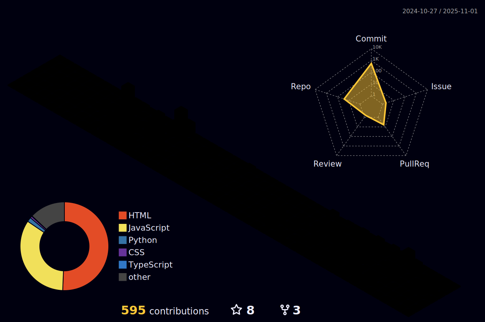

<h1 align="center">
    
</h1>

  

###
<h2 align="center">TECH STACKS</h2>

  
  
  
  
  
  
  
  
  
  
  
  
  
  
  
  
  
  
  

###
<h2 align="center">SOCIALS</h2>

  
  
  

  <h2>🐍 My Contributions 🐍</h2>
   
  
  <h2>Language Wise Contribution and Other Info</h2>
    
     

<h2 align="center">SPOTIFY</h2>

  

